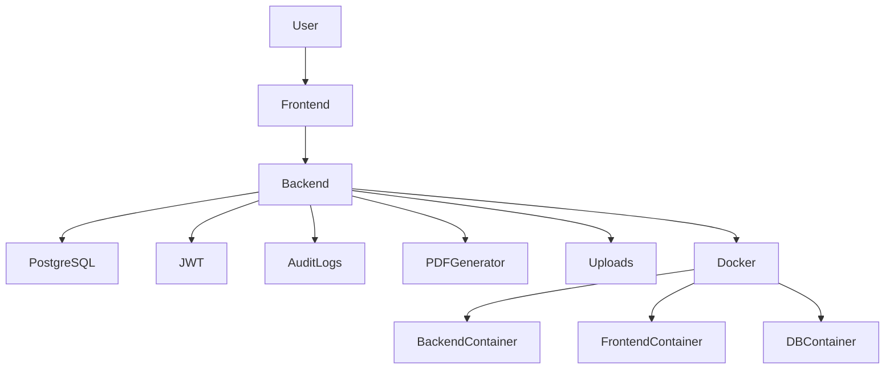
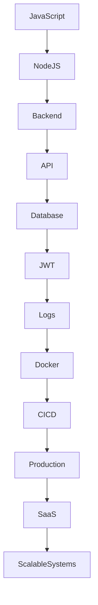

---

# 👨‍💻 Sobre Mim

🎓 Estudante de **Análise e Desenvolvimento de Sistemas — UNIP**

Sou apaixonado por tecnologia e pela construção de sistemas reais que resolvem problemas de negócio.  
Atualmente estou focado em evoluir como **Backend Developer**, criando aplicações **seguras, escaláveis e prontas para produção**.

Tenho trabalhado no desenvolvimento de plataformas **SaaS completas**, aplicando conceitos modernos de engenharia de software, como:

⚙️ **Arquitetura SaaS Multi-Tenant**  
🔐 **Autenticação JWT e controle de permissões (RBAC)**  
📊 **Logs estruturados e auditoria de ações sensíveis**  
🛡 **Proteção contra XSS e CSRF**  
🧪 **Testes E2E com Cypress**  
🐳 **Containerização e ambientes com Docker**  
📈 **Monitoramento, health checks e observabilidade**  

---

## 🧠 Stack que utilizo nos projetos

**Backend**

Node.js • Express • Prisma • Sequelize • PostgreSQL • JWT

**Frontend**

React • Next.js • Vite • TailwindCSS • React Router

**Segurança e Qualidade**

Rate Limiting • CSRF Protection • Structured Logging • Audit Trail

**DevOps**

Docker • Docker Compose • CI/CD • GitHub Actions

**Testes**

Jest • Vitest • Cypress

---

🚀 Meu objetivo é me tornar um **Backend Engineer**, especializado em **arquitetura de sistemas, segurança e plataformas SaaS escaláveis**.

---

# 🧠 Tech Stack

### 🚀 Backend

---

### 🧠 Linguagens

---

### 🗄 Banco de Dados

---

### 🎨 Frontend

---

### 🧪 Testes

---

### ⚙️ DevOps & Ferramentas

---

### 🔐 Segurança

JWT • CSRF Protection • Rate Limiting • Structured Logs • Audit Trail

---

# 📊 GitHub Stats

| 📊 Estatísticas | 🔥 Commit Streak | 🧠 Linguagens |
|:-:|:-:|:-:|
|  |  |  |

---

| 📈 Activity Graph |
|:-:|
|  |

---

| Profile Visitors |
|:-:|

  

---

# 🚀 Projeto Destaque

## 🏭 EDDA — Sistema de Relatórios Técnicos Industriais

Sistema web completo para gestão de relatórios técnicos de manutenção industrial, desenvolvido com foco em  
segurança, arquitetura escalável e uso em produção.

🔗 Repositório:  
https://github.com/Richard-Sup-Dev/edda-sistema

---

### ⚙️ Funcionalidades

✔ Geração automática de relatórios em PDF  
✔ Upload de fotos técnicas  
✔ Cadastro de clientes e orçamentos  
✔ Dashboard com métricas  
✔ Autenticação JWT  
✔ Controle de permissões (roles)  
✔ Logs estruturados e auditoria  
✔ Rate limiting e validação de dados  
✔ Sistema pronto para Docker  
✔ Testes automatizados  

---

### 🧠 Tecnologias utilizadas

Backend  
- Node.js  
- Express  
- PostgreSQL  
- Sequelize  
- JWT  
- PDFKit  

Frontend  
- React  
- Vite  
- Tailwind CSS  
- React Router  
- Axios  

DevOps  
- Docker  
- Docker Compose  
- GitHub Actions  

---

### 🎯 Objetivo do projeto

Criar um sistema real para uso em produção, aplicando boas práticas de:

- Arquitetura de software
- Segurança
- Testes
- DevOps
- Escalabilidade

---

## 🏗 Arquitetura do Projeto — EDDA

## Roadmap de Aprendizado

---

# 🎯 Objetivo Profissional

Meu objetivo é atuar como **Desenvolvedor Backend**, participando da construção de sistemas escaláveis, seguros e bem estruturados.

---

# 📫 Contato

GitHub  
https://github.com/Richard-Sup-Dev

LinkedIn  
https://www.linkedin.com/in/richard-itsou-254725361/

---

⭐ Obrigado por visitar meu perfil!
